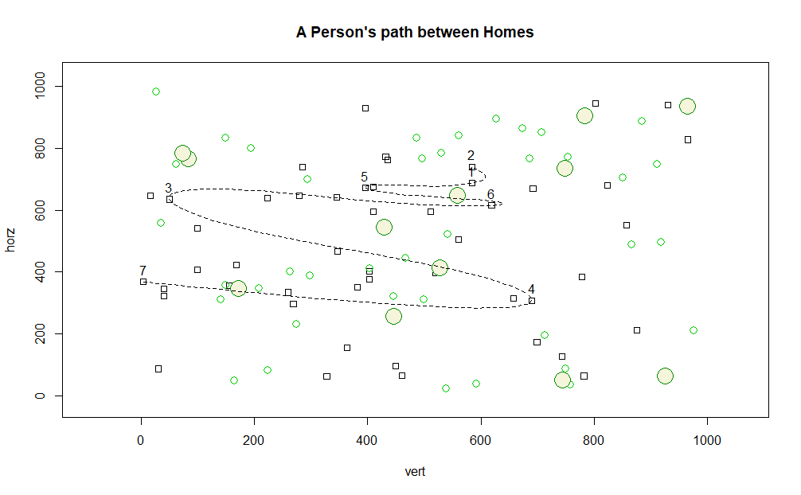

# Sampling and Plots
A neighborhood map 1000 x 1000 was created and houses, small trees, and large trees were given artificial locations on the map. Seven of the fifty houses were selected at random, given a number, and used as points to plot the path a person would take between the houses.

