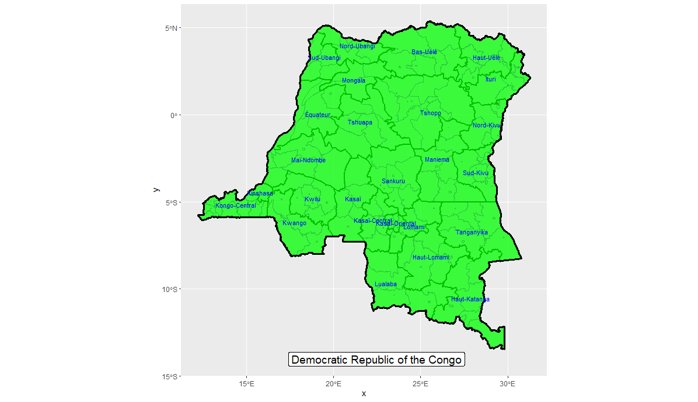
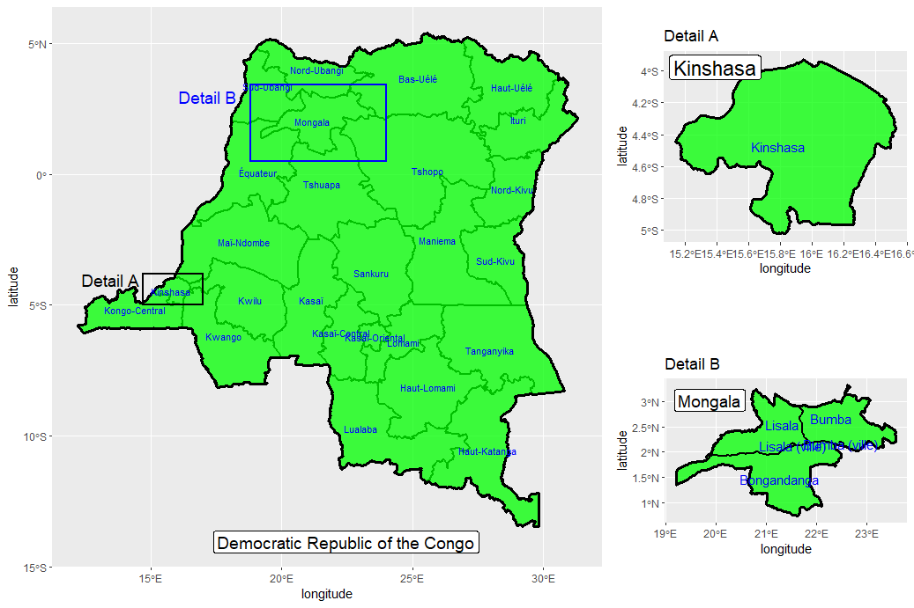

# Practice with shapefiles

The first major exercise delt with retrieving shapefiles from GADM to plot in ggplot (tidyverse package). I used adminstrative levels 0 through 2 for the Democratic Republic of Congo (DRC) to create the plot below.

Following this plot, I filtered two regions in the DRC: Mogola and Kinshasa. After refining the plot above, I combined all three in a single plot. Were more descriptive data being shown other than just the spatial boundaries, this would allow for better insight into the plot and a better aesthetic.

I originally selected DRC because of the Ebola outbreak(s) ongoing there. Unfortunately, I underestimated the size of the country so for the sake of my computer's memory, this shall be the last we see of DRC. Press F to pay respects.
