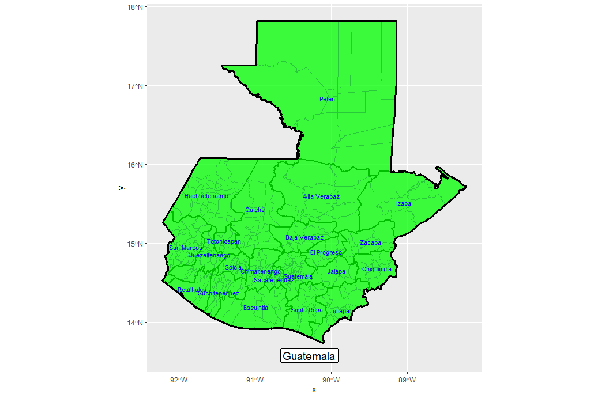
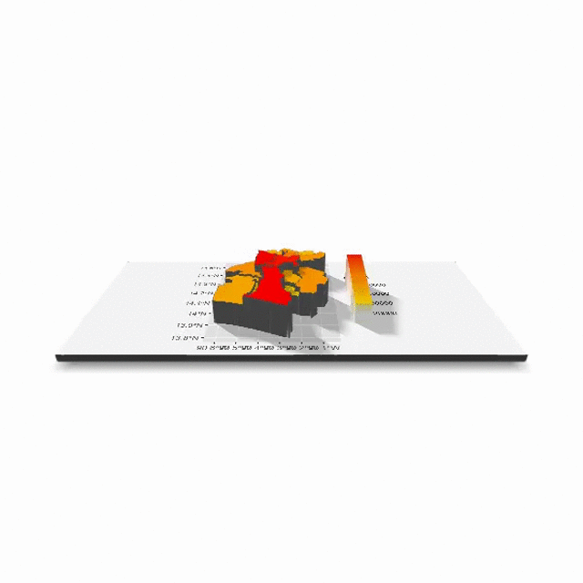

# Using raster files to display data over shapefiles

Since I said goodbye to the DRC, I have switched to Guatemala, a considerable more manageable country in terms of my CPU. Shapefile data was again retrieved from GADM.

Population data (2020) in the form of a raster file was then retreived from WorldPop and grafted onto the spatial data from the shapefiles. Below are displayed aggregations of the raster data by adm1 and adm2 shapefile levels.

 

Again to save CPU space, I hope to be focuses on Santa Rosa, a municipality near the center of Guatemala. 

