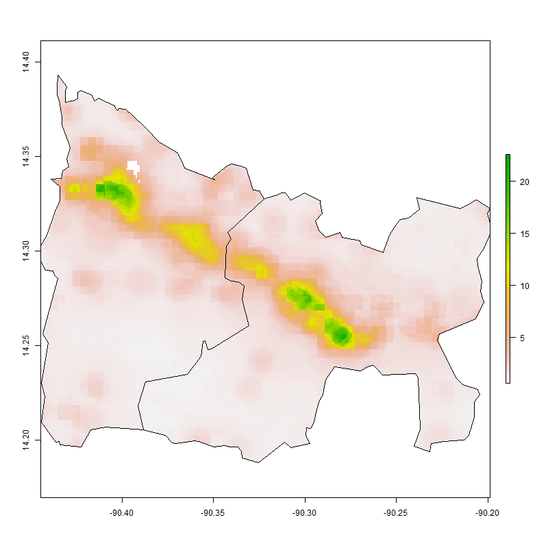
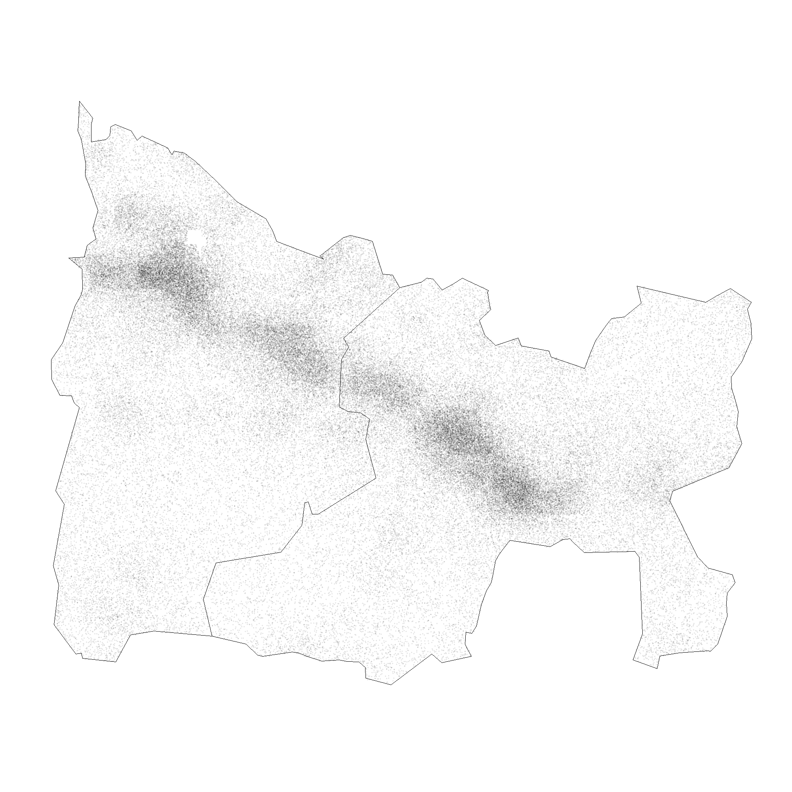
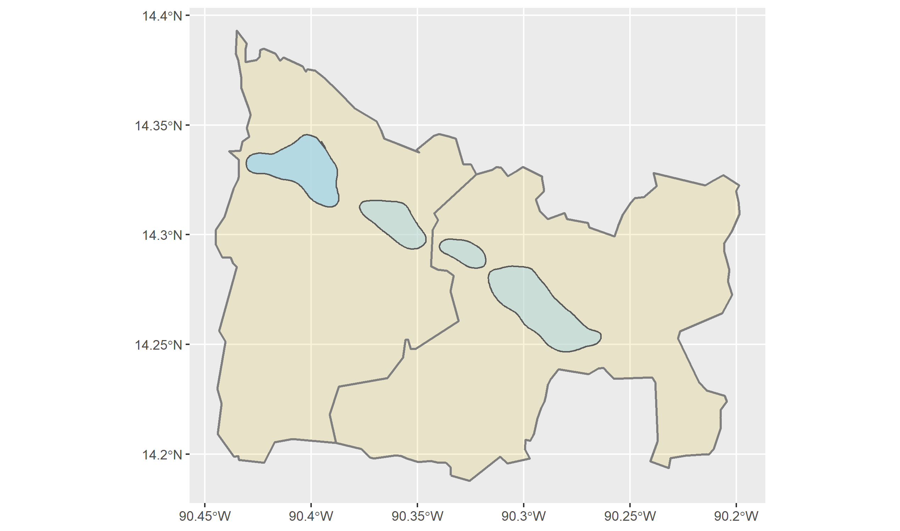
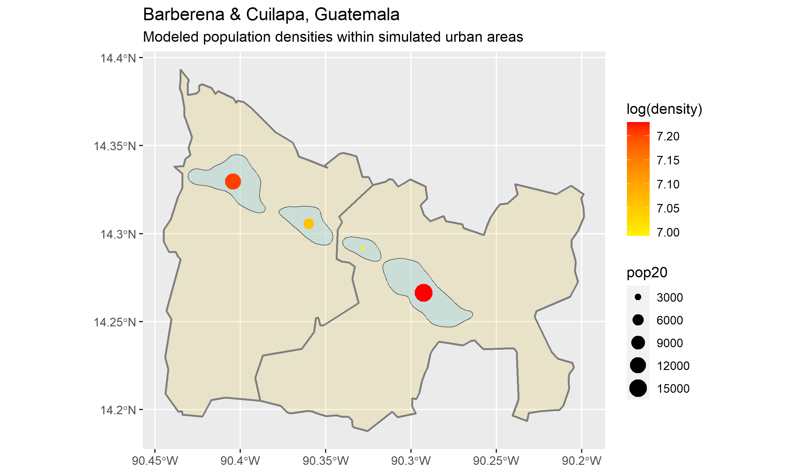

# Density and Population Modeling
I started out with Barberena and Cuilapa, states in Guatemala, and first plotted the population for both states

Then I used the raster data to create a distribution of points equal to the total states' populations with the raster data as a guide to get a measure of density.

To get an idea of where urban areas are, I then created a contour line where the density plot = 10,000,000. The resulting four regions represent urban areas

Finally, I used raster data to add population, area, and density data to the urban areas

