  # Project 2
  
  ## Generation of a Synthetic Population for Santa Rosa, Guatemala
  
  Guatemala is located in Central America and has a population of around 17 million persons. Multiple applications exist for modeling such populations. Data on how persons move through space to travel to workplaces, go shopping, or visit other necessities can help inform urban planners, politicians, and businessmen and businesswomen how to create amenities that will be most useful to citizens or to help maximize profits. Modeling human activity in any region can be extremely difficult for many reasons. Much data collection that could be used in modeling these areas comes from surveys, which may be out-of-date, inaccurate, or inconsistent to the point of requiring heavy processing before use in data science applications. An alternative option is to use synthetic generated populations which use survey data as a starting point but can then be used to fill in the gaps in analysts’ knowledge.
  For this particular assignment, I will be trying my hand at developing a synthetic population model based on survey data obtained from The Demographic and Health Surveys Program (DHS program). Because the survey data contains potentially sensitive and personal information, I had to fill out a project request form and get approval from the DHS program. This limits access to the data and helps maintain privacy. The survey data contained household information from 21,383 households in Guatemala. Variables of interest for analysis were subset to another data frame and included location, observation weight, household size, ages of those in the household, genders of those in the household, education level of those in the household, and wealth of those in the household. I then summed the weights of the household data and comparing it to the number of rows in household data. The result for both was 21,383, demonstrating no error had been introduced by sub-setting. Most entries existed in coded formats (i.e., education level for survey participant 1 = 3), and as a result needed to be decoded from the survey report. Unfortunately, since this survey took place in Guatemala, and I am about as fluent in Spanish as you would expect after 4 semesters of high school Spanish, these codes remained mostly enigmatic. However, I was able to decode household locations, which was very useful since I am only interested in modeling the population for the state of Santa Rosa. However, before I could do this, further data processing needed to be done.
	To model a synthetic population, you need people, not households. The HDS program household data includes rows for each participant’s response to each survey question. To separate this data out into individuals, I pivoted the columns for gender, age, and education into rows and merged the output into a single data frame. I tested the result by again, summing the weights and comparing the output to the number of rows in the pivoted data frame. The results were 103716.9 and 102406 respectively, indicating that some error had been introduced by disrupting the weighed data (<2%). Running an analysis to determine the person sample proportion revealed that the pivoted data from households represents roughly 0.5% of the entire population of Guatemala (as compared to 2020 raster data from Worldpop.org). 
	I hoped to compare Guatemala and Santa Rosa pivoted data in terms of accuracy and introduced error, but unfortunately my computer was not able to handle the computing power required for pivoting the entire data set from Guatemala. However, I was able to subset Santa Rosa from the overall Guatemala household data. The proportionate share of Santa Rosa household weights was 506.7 while the number of households contained in the subset was 913. Since the ultimate goal is to turn this household subset into a subset of individuals, I compared the size of the households in the Guatemala data set and the Santa Rosa data set (gold and green respectively).
 
 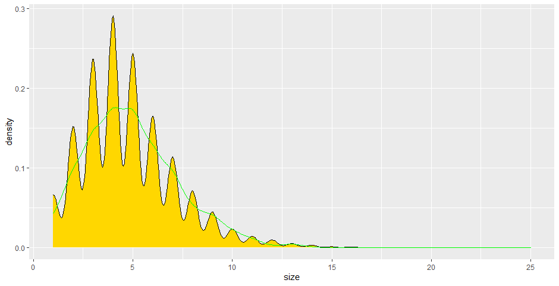
 
Clearly the Santa Rosa data set underestimates population trends. However, If samples from the data sets are randomly incorporated into a synthetic population equal to the size of Santa Rosa, the data is a very good match (again, gold is sampled from the Guatemala data and green is sampled from the Santa Rosa Data.
 
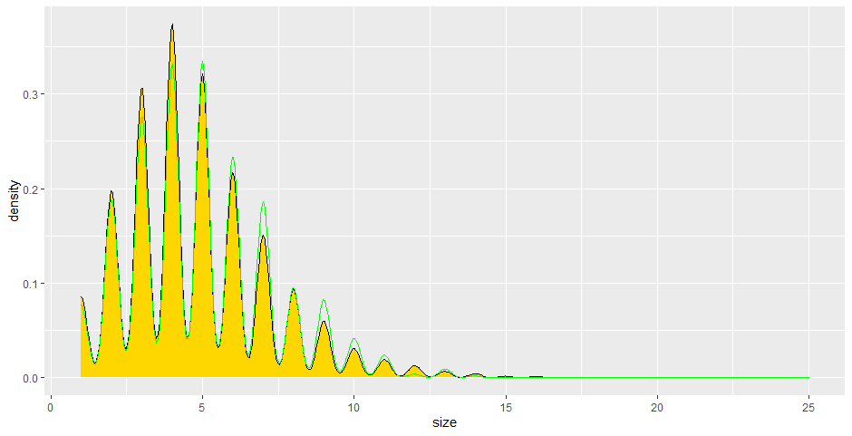
 
This indicates that a random sample equal to the population of Santa Rosa from Santa Rosa survey data yields a viable synthetic population. Since this data is also derived from raster data (Worldpop.org), I also included the population locations to increase the spatial accuracy of the model. Error introduced by doing this was measured as described above. Summed data weights equaled 83,407.36 while the data rows equaled 83,356. Weighed error was calculated to be equal to 0.0002. The resulting data frame was the pivoted (again, just the variables for gender, age, and education). Roughly 200 individual observations were cut from the gender and age pivots before joining with the education pivot. This was due to some unknown discrepancy in the survey data which seems to have been education was not reported in several households. Dropping the data from the other two data frames allowed all three pivots to be joined based on unique identifying numbers. Summed weights post-pivot for the data set was 11,213,542 while the total number of individuals was 11,164,428. The pivoted data (synthetic population) when divided by the Worldpop.org raster data for population was equal to 27.01. The error here is possibly due to the year difference. The DHS program data which the survey is based on was created in 2014-2015 while the Worldpop.org data is from 2020. Between those five years, Guatemala experienced population growth, increasing from 15 million to 17 million people. Below is shown the distribution of the synthetic population and then the raster data.
	
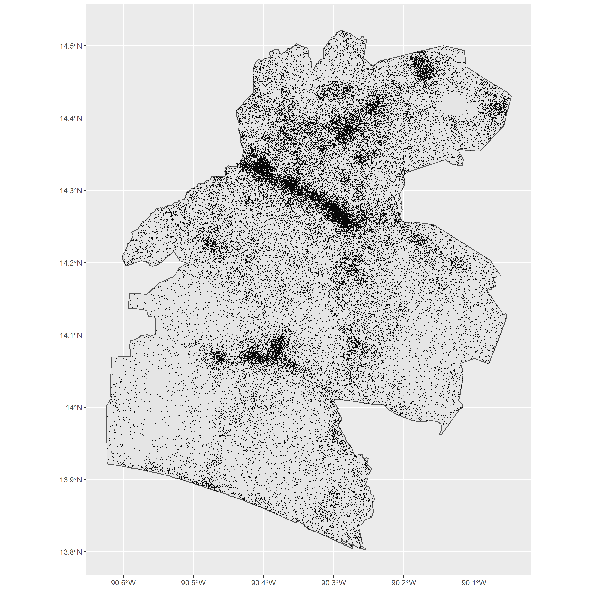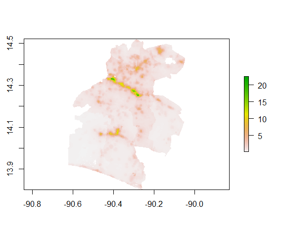
	
  With the synthetic population assembled, some analysis of the variables age, size, gender, and education was conducted. First heat maps were generated with the heatmaply library for raw data, scaled data, normalized data, and percentage data.
  
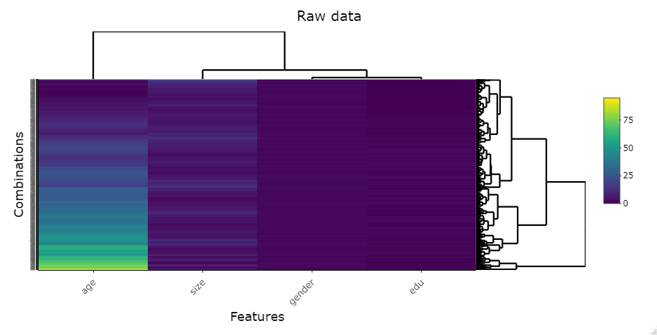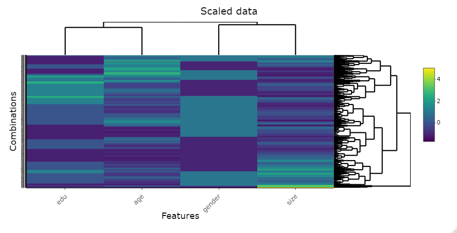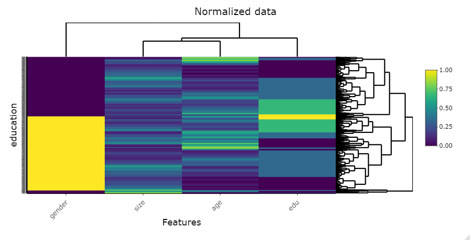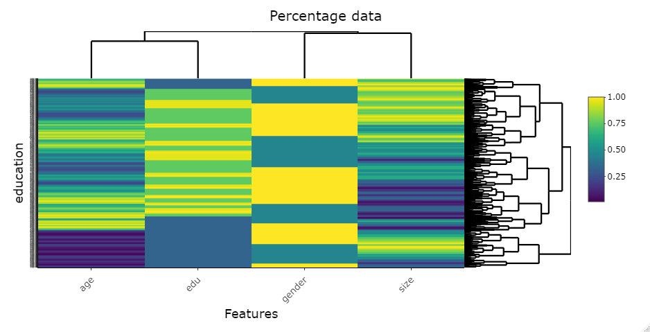

  The raw data indicated varying predicatbility for age. Scaled data was mostly homogenous like the raw data, though suggested size as a predictor. The normalized data indicated strong predictability in gender, potentially due to the binary outcomes of the variable, as well as scaled predictors for education. Percentage data indicated numerous areas of predictors.

Following the heat map comparison, a multinomial regression and ranger regression were conducted on the data to identify correlations and predictors. Based on these data, I produced gain and ROC charts from the mulitnomial regression:
  
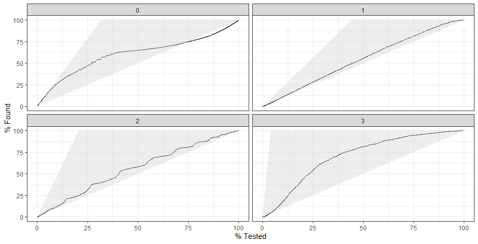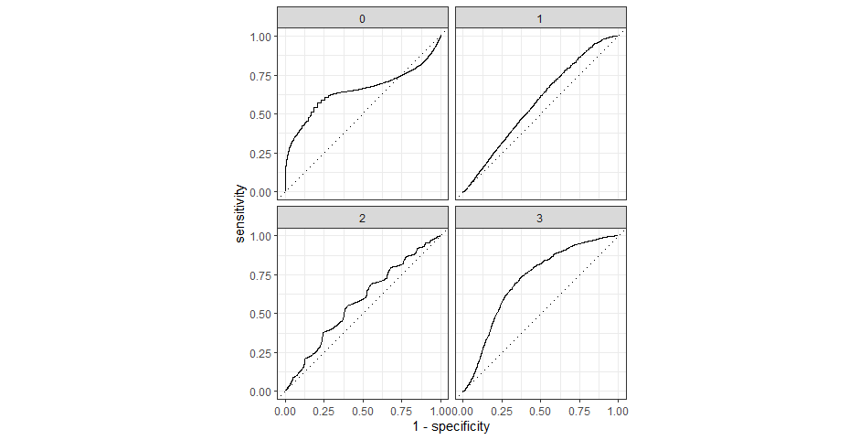
 
The gains chart suggests size and gender can both be predicted well by the other variables. The ROC curve indicates poor predictive power for all, though age fair the best.
 
And from the ranger regression:
 
 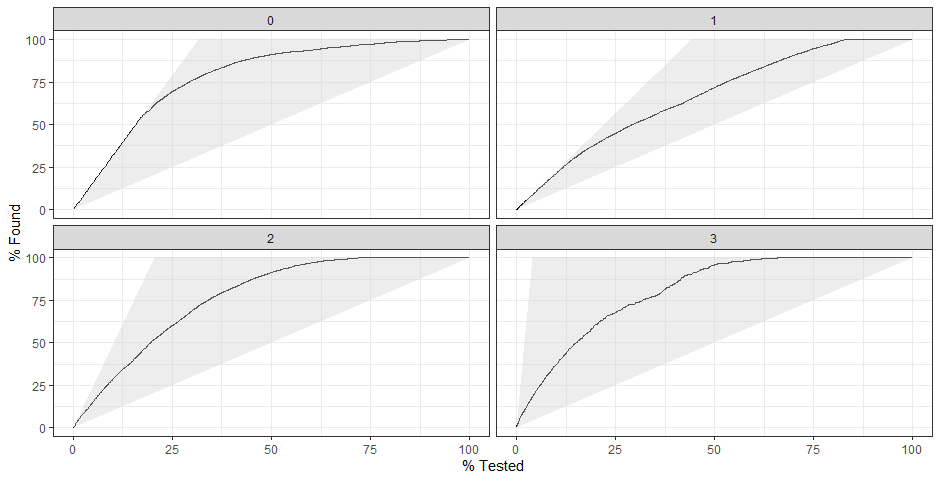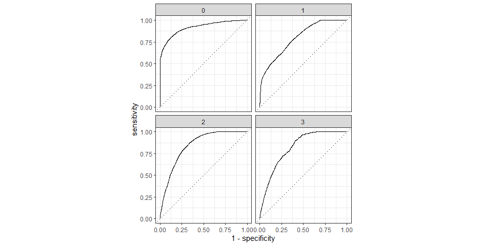
  
The gains charts showed education could be predicted fairly well by the other variables, which was supported by the ROC chart.
