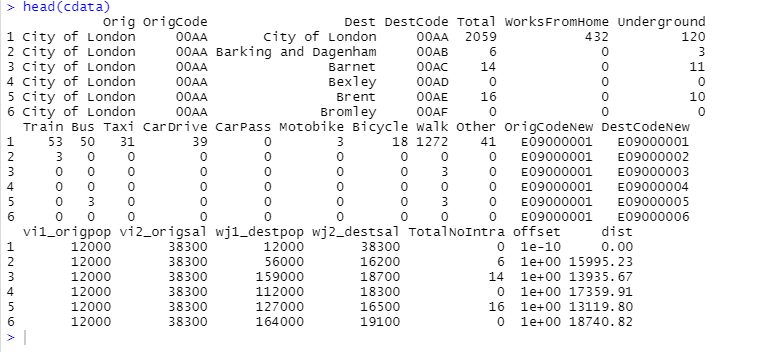
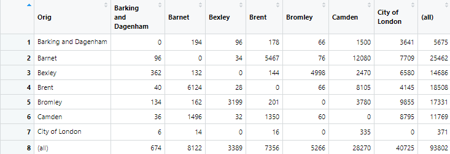
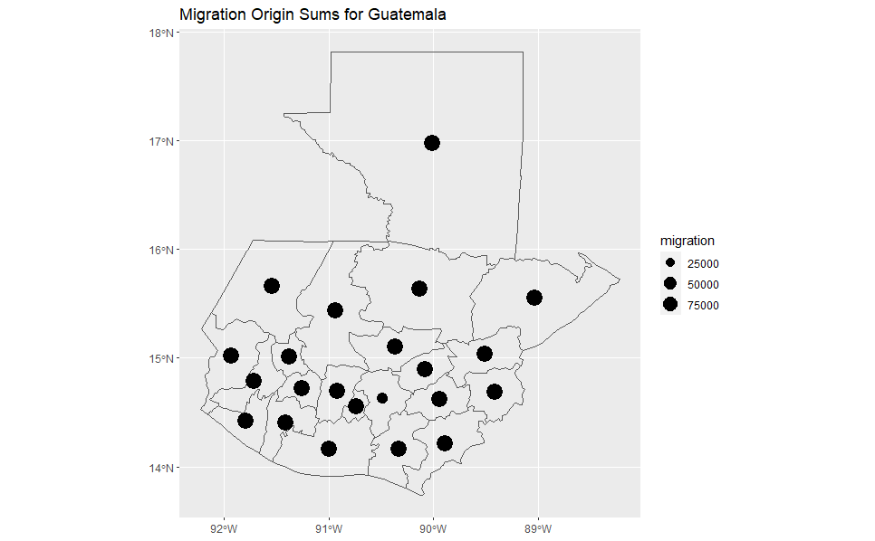
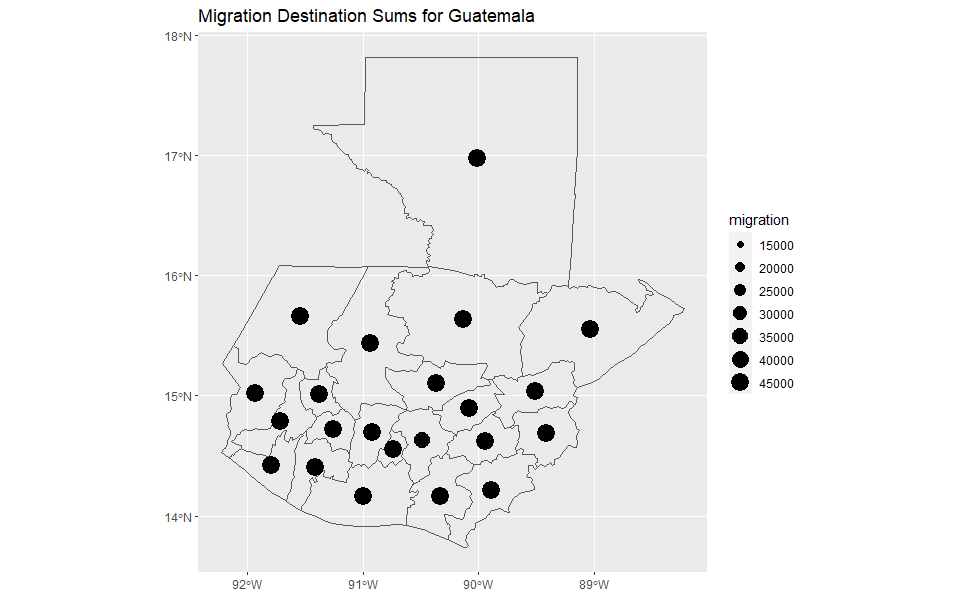
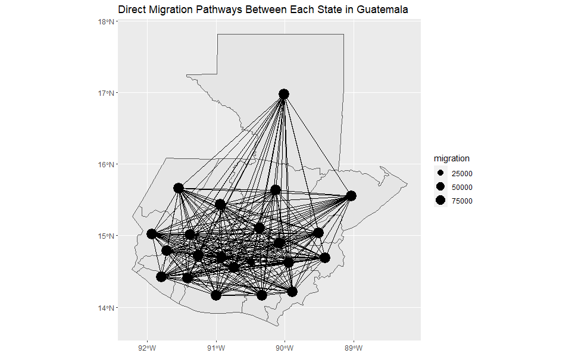
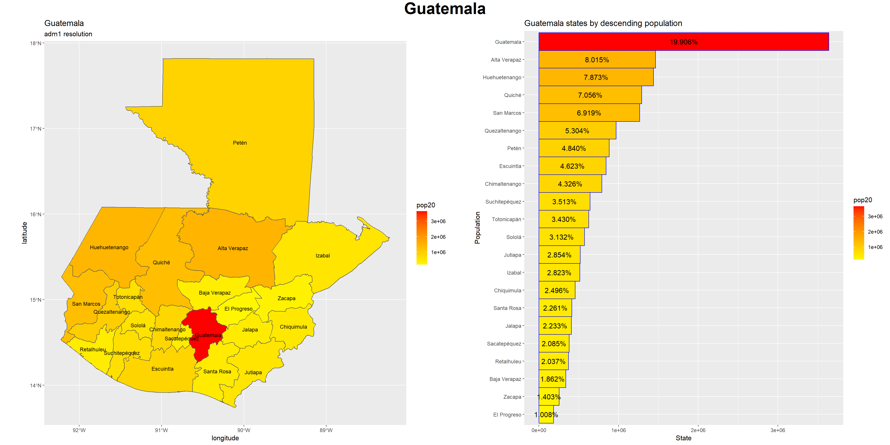
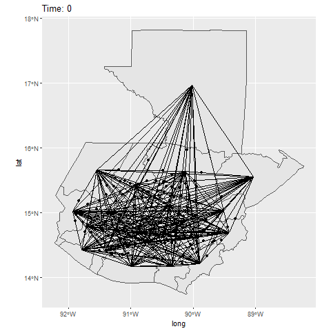
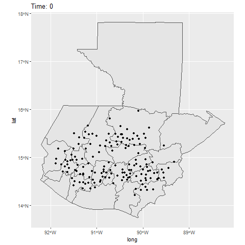

# Project 3 - Final
  
## London Gravity Model Analysis

To practice implementing a gravity model, I followed the exercise laid out in Adam Dennett's "Dr Ds Idiots Guide to Spatial Interaction Modelling for Dummies - Part 1: The Unconstrained (Total Constrained) Model." The area of focus is the city of London (England). Using json data availible from the United Kingdom's government statistics, I organized the borough's into coded regions. I then imported commuting, population, and income data from a provided dropbox link. The data was then organized by borough code.

Due to package bugs, I did not run the travel network as an animation (the class was told not to) but a sample of the final is below. Population and income data was used to determine movement in this gravity model output. The matrix illustrates the number of individuals that migrated from one borough to another as determined by the model's parameters of population and income.

This exercise exemplifies the approach presented in the paper by Garcia et al. in 2015, "Modeling internal migration flowsin sub-Saharan Africa usingcensus microdata."

## ABM of Guatemala

Since I have used Guatemala as my area of focus this entire semester, I see no reason to change it up now. In the Garcia et al. paper we discussed in class, a similar model to what I will be displaying here was used to estimate population flow. The major difference is my model does uses recorded migration data to inform flow. Using migration data from WorldPop.org, I created shapefiles of the flow of migration, both in terms of its origin and its destination. I then combined these two dataframes to illustrate simplified migration routes between all states in Guatemala. These originate at each states centerpoint.

After setting up these initial parameters, I distributed points across Guatemala roughly equivalent to the population distriubtion (shown below). The two animations are the same except I have removed the migration lines in one for more clarity.

 

It would be useful in cases to where there is not traffic or migration data to have other predictors, possibly remotely gathered, which would be able to inform researchers of population migration in the region. Night lights are one example which can be gathered remotely and indicate a higher population density, as well as potentially a higher standard of living, which is a desirable pull factor.
