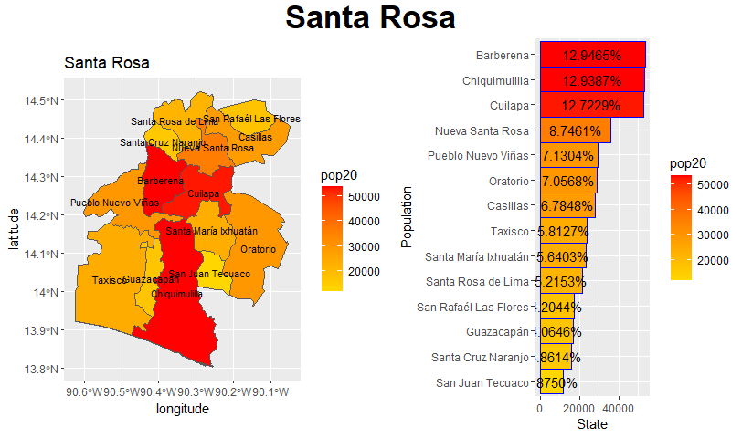

# Project 1
## Population Modeling and Accessibility Plotting
Project 1 focused on two municipalities within Santa Rosa, Guatemala. I selected Barberena and Cuilapa because their total population was manageable for my computing resources (roughly 100,000 people) within a collected and cohesive area.

Within these two municipalities, I created a model of population distribution and subsequent "urban" zoning areas. I then plotted roads and the the single hospital (white) and pharmacy (pink) in the area.

Based on the almost linear concentration of urban areas and roads, there should be some explanatory variable for the population distribution. For a qualitative explaination, I overlaid the urban areas and roads onto a topographical plot of the region.

 

These plots clearly demonstrate that the Baberena/Cuilapa region is extremely mountainous, and that urban areas have developed in the most convenient areas: valleys. The concentrated settlement pattern also explains the singular hospital in the region, and the presence of few major roads into the region. Major roads do however connect the urban areas, as this is where the vast majority of traffic is likely to travel.
